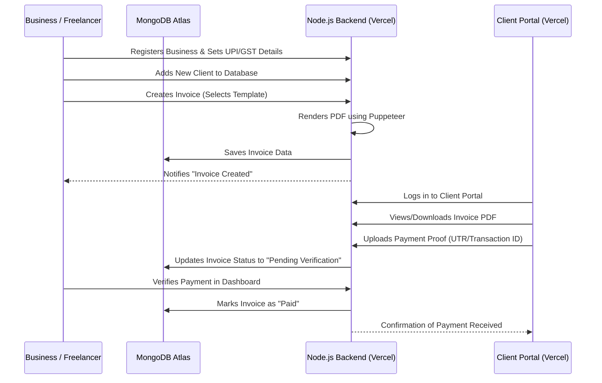

# <div align="center">BharatBill</div>

<div align="center">
  <strong>The Professional GST Invoicing & Client Management Ecosystem</strong>
</div>

<div align="center">
  <p align="center">
    <a href="https://invoice-generator-and-tracker.vercel.app/">
      
    </a>
    <a href="https://github.com/Abiram08/Invoice-Generator-Tracker">
      
    </a>
    
    
  </p>
</div>

---

## 📖 Table of Contents
- [🔍 About the Project](#-about-the-project)
- [⚙️ How it Works](#️-how-it-works)
- [✨ Core Modules](#-core-modules)
- [🛠️ Tech Stack](#️-tech-stack)
- [📂 Project Architecture](#-project-architecture)
- [🚀 Quick Start](#-quick-start)
- [🤝 Contributing](#-contributing)

---

## 🔍 About the Project

**BharatBill** is built to solve a critical pain point for the Indian freelance and small business community: **Professionalism meets Localization.** 

Standard global invoicing tools often lack support for GSTIN, INR symbols, and UPI-based payment tracking. BharatBill bridges this gap by providing an end-to-end platform where businesses can manage clients, generate beautiful GST-compliant PDFs, and track payments through a dedicated portal.

---

## ⚙️ How it Works

BharatBill operates as a centralized hub connecting **Businesses** (Service Providers) and their **Clients**.

### 🔄 The System Flow



---

## ✨ Core Modules

### 1. 💼 Business Dashboard
The nerves of the application. Business users (Freelancers or Agencies) get a high-level overview of their financial health.
- **Real-time Analytics**: Bar charts and line graphs (via Recharts) showing monthly revenue vs. outstanding payments.
- **Product Management**: Maintain a catalog of services/products with predefined rates and tax categories.

### 2. 📄 Invoice Engine
A sophisticated PDF generator that doesn't just "print a page."
- **Multiple Templates**: Switch between Standard, Modern, Minimal, Corporate, and Creative styles.
- **GST Compliance**: Automatic calculation of CGST, SGST, and IGST based on client location.
- **Automated PDFs**: Uses a headless Chromium instance (Puppeteer) to ensure pixel-perfect rendering from HTML templates.

### 3. 👥 Client Management & Portal
Instead of sending static emails, give your clients a home.
- **Self-Signup**: Clients can request to be added to your business database.
- **Payment History**: A complete ledger for clients to see what they've paid and what's remaining.
- **Document Hub**: A centralized place for clients to download current and past invoices.

### 4. 🛡️ Authentication & Security
- **JWT (JSON Web Tokens)**: Stateless authentication for both business users and clients.
- **Role-Based Access**: Strict separation between Business features and Client Portal data.
- **Secure Hashing**: Bcrypt integration ensuring user passwords never leave the database as plain text.

---

## 🛠️ Tech Stack

| Domain | Technolgies |
| :--- | :--- |
| **Frontend** | React 18, React Router 6, Tailwind CSS, TanStack Query (Server State), React Hook Form |
| **Backend** | Node.js, Express.js (v4), JWT, Bcryptjs, Puppeteer, Nodemailer |
| **Auth** | JWT (Stateless), Bcryptjs |
| **Database** | MongoDB Atlas, Mongoose ODM |
| **Deployment** | Vercel (Frontend & Backend) |

---

## 📂 Project Architecture

```bash
z:\Projects\Invoice\
├── backend/                # The REST API Layer (Serverless Config for Vercel)
│   ├── models/             # Schema definitions for Data Persistence
│   ├── routes/             # Controller logic for all endpoints
│   ├── middleware/         # Auth, Helmet Security, Rate Limiting
│   └── server.js           # Entry point for Serverless functions
├── src/                    # The Client Application
│   ├── pages/              # High-level components (Analytics, Clients, Invoices)
│   ├── components/         # Reusable UI Patterns (Layout, Tables, Forms)
│   ├── context/            # React Context for global state (Auth, UI)
│   └── utils/              # Calculation helpers & API interceptors
└── public/                 # Manifest, Index.html, and Static Assets
```

---

## 🚀 Quick Start

### Prerequisites
- Node.js installed locally.
- A MongoDB cluster (Atlas recommended for cloud deployment).

### Local Setup

1. **Clone & Install**
   ```bash
   git clone https://github.com/Abiram08/Invoice-Generator-Tracker.git
   cd Invoice-Generator-Tracker
   npm install && cd backend && npm install
   ```

2. **Backend Config (`backend/.env`)**
   ```env
   PORT=5000
   MONGODB_URI=your_mongodb_uri
   JWT_SECRET=your_secret_key
   FRONTEND_ORIGIN=http://localhost:3000
   ```

3. **Frontend Config (`.env`)**
   ```env
   REACT_APP_API_URL=http://localhost:5000/api
   ```

4. **Run**
   ```bash
   # Window 1 (Backend)
   cd backend && npm run dev
   # Window 2 (Frontend)
   npm start
   ```

### ☁️ Vercel Deployment

Both components are optimized for Vercel. 
- **Frontend**: Automatically detected as a React application.
- **Backend**: Configure the `backend` directory with a `vercel.json` if necessary, or deploy as a standalone serverless function.

---

<div align="center">
  <h3>Professional. Precise. Powerful.</h3>
  <p>BharatBill — Empowering Indian Small Businesses</p>
</div>

